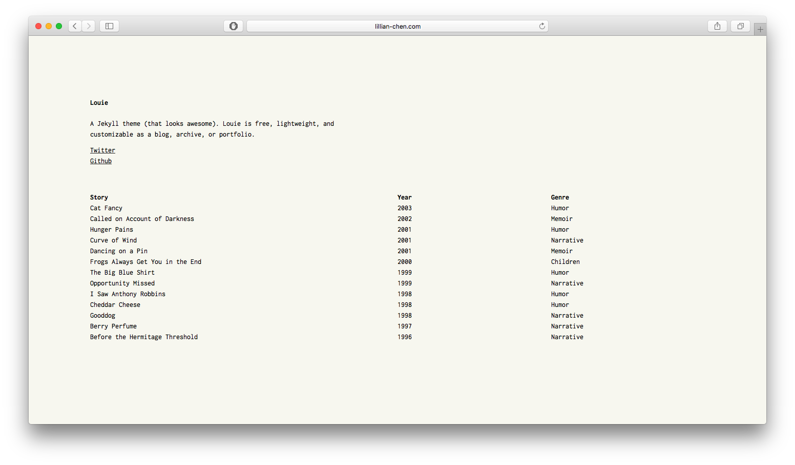
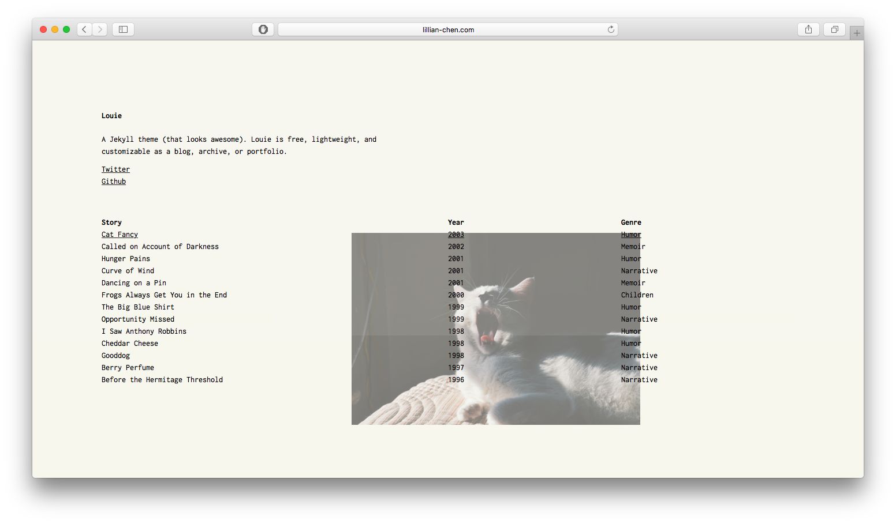
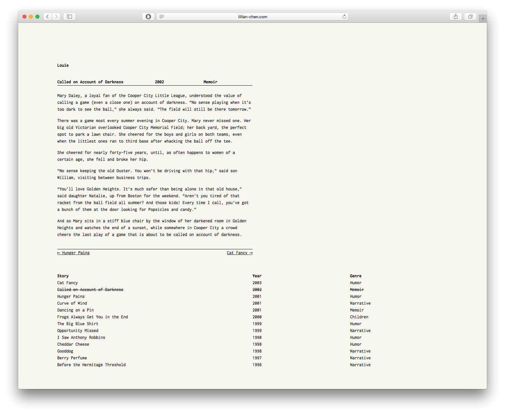

# Louie
[](https://badge.fury.io/rb/louie)

A jekyll portfolio generator (that looks awesome). Louie is free, lightweight, and customizable as a blog, archive, or portfolio.





## Installation
Add this line to your Jekyll site's Gemfile:

```ruby
gem "louie"
```

And add this line to your Jekyll site's `_config.yml`:

```yaml
theme: louie
```

And then execute:

    $ bundle

Or install it yourself as:

    $ gem install louie

## Usage
### Basic configurations
Here are a few general info fields to populate your new site right away.

```yaml
title: HTML <title>, which is overridden by post/page title if exists
baseurl: ""
favicon: "/path/to"
g_analytics: UA-12345678-1

header: name of your site here
desc: >
  description of your site, can be a quick bio if it's a portfolio. It supports HTML so add your links, imgs, whatever!
```

### Social media links
To add links to your social sites (linkedin, twitter, etc) below the bio, create a file named `social.yml` in your `_data` folder (which you may not have created yet). Inside it, follow the following format:

```yaml
- title: Twitter
  url: http://twitter.com/lllychen
- title: Github
  url: http://github.com/lllychen/louie
# and so on...
```

### Column names
The names for each column is defaulted to `Title`, `Date`, and `Category`, respectively. However, this can be changed according to use cases. For instance, an archive of classic literature may need to adjust accordingly:

```yaml
post_title: Story
post_date: Year
post_cat: Genre
```

### Date format
The default format for dates is `%b %-d, %Y`, which outputs `Jan 1, 2017`. However, you can customize it according to [this](http://jekyll.tips/jekyll-casts/date-formatting/#date) in `_config.yml` such as follows:

```yaml
date_format: "%m/%d/%Y"
```

### Post variables
You can include the following variables in the front matter for posts:

```yaml
title:  Berry Perfume
category: Narrative
img: [ OPTIONAL: url or path in directory ]
```

The `img` variable is used to produce a randomly placed image associated with this post when you hover over it. If you omit it, there simply won't be a picture and all is still well.

If you prefer not to have the category in your post permalink, follow the guidelines [here](https://jekyllrb.com/docs/permalinks/) to remove it among other configurations.

### Post pagination
To include previous and next links at the bottom of a post page, leave the following setting to `true`. Otherwise, change to `false`.

```yaml
prev-next: true
```

## License
The theme is available as open source under the terms of the [MIT License](http://opensource.org/licenses/MIT).

## Credit
Stories created and collected by [Story Bytes](http://www.storybytes.com/view-length/0256-words/index-0256.html).

Images collected by [Unsplash](https://unsplash.com/)
